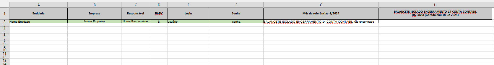
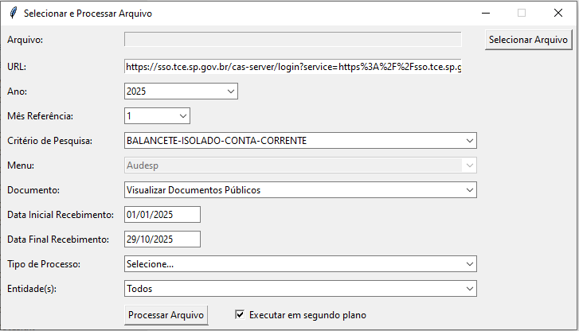
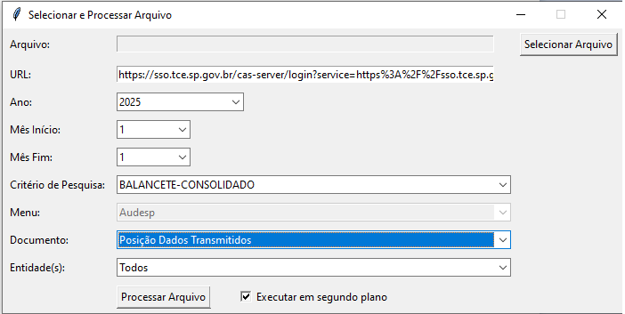

# Consulta TCE-SP Playwright GUI

## 🛡️ Descrição do Projeto

Este projeto é uma aplicação de desktop desenvolvida em Python com `Tkinter` para fornecer uma interface gráfica de usuário (GUI) para automação de consultas no portal do Tribunal de Contas do Estado de São Paulo (TCE-SP) ou sistema correlato que utilize o padrão AUDESP.

A automação é realizada utilizando a biblioteca `Playwright`, permitindo o login, a navegação por menus ("Auditoria Eletrônica de Órgãos Públicos") e a aplicação de filtros em massa (Mês, Ano, Tipo de Documento, Entidade) a partir de dados fornecidos em um arquivo Excel.

O objetivo principal é processar uma lista de entidades/usuários, realizar as consultas e registrar o **Status** e a **Data de Recepção** dos pacotes de dados transmitidos, atualizando a planilha de entrada (função `atualizar_planilha`).

## ✨ Funcionalidades Principais

* **Interface Gráfica (Tkinter):** Permite a seleção visual do arquivo de entrada e a configuração dos parâmetros de consulta.
* **Web Automation (Playwright):** Realiza login e navegação no portal do TCE-SP de forma eficiente.
* **Processamento em Lotes:** Lê credenciais e parâmetros de consulta de um arquivo Excel (`.xlsx`) ou TXT, permitindo a execução de consultas para múltiplas entidades.
* **Modo Background:** Opção para executar a automação sem exibir a janela do navegador (`headless` é ativado se o checkbox for marcado).
* **Registro de Dados:** Salva logs (`dados_pacotes_...`) e atualiza o arquivo Excel de entrada com os resultados da consulta.

## 📄  Estrutura do Arquivo de Entrada

🖥️ UI - Telas do Aplicativo
A interface gráfica de usuário (GUI) é construída com Tkinter e apresenta os seguintes elementos para a consulta ao TCE:

Tela de Seleção e Configuração
Esta tela inicial permite ao usuário carregar o arquivo de entrada com os dados de consulta e definir os parâmetros globais, além dos filtros essenciais de Entidade, Documento e Datas de Referência.

## ⚙️ Pré-requisitos

Para rodar este projeto, você precisará ter instalado:

1.  **Python 3.x**
2.  **Navegadores suportados pelo Playwright** (Chromium é o padrão, mas o código também menciona Edge e Firefox).

